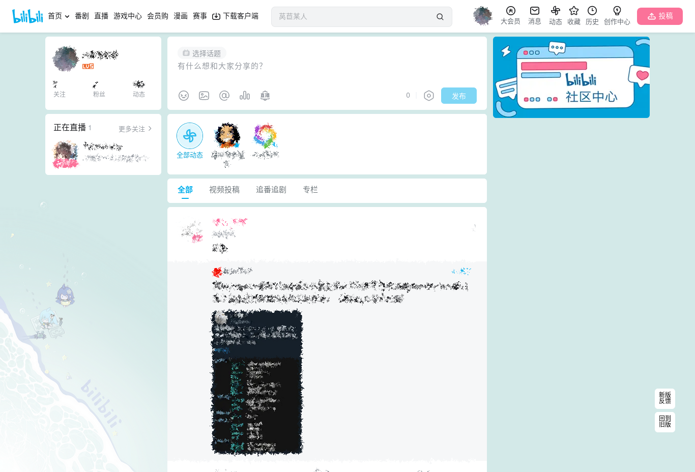

# 闭嘴吧逼逼话题鸡

## Very Important Notice

Try [uBlock Origin (uBO)](https://github.com/gorhill/uBlock) and add filter `t.bilibili.com##.topic-panel`**

Unless you don't/couldn't use uBlock Origin, there is no need to use this userscript.

---

## Introduction

[简体中文 README](README_zh-cmn-Hans.md)

Hide the Bilibili(www.bilibili.com) Topic Panel. Out of sight, out of mind.

**Out of sight, out of mind.** **知らぬが仏**

---

## Screenshot

### Old

-   Before
    

-   After
    

### New

-   Before
    

-   After
    

## Usage

### Installation

Install a **Userscript manager browser extension**. **Tampermonkey** is recommended.

-   [Chrome Web Store](https://chrome.google.com/webstore/detail/tampermonkey/dhdgffkkebhmkfjojejmpbldmpobfkfo)
-   [Firefox Browser Add-ons](https://addons.mozilla.org/en-US/firefox/addon/tampermonkey/)
-   [Microsoft Edge Add-ons](https://microsoftedge.microsoft.com/addons/detail/tampermonkey/iikmkjmpaadaobahmlepeloendndfphd)

You can try any other userscript manager. See more at [Greasy Fork](https://greasyfork.org/).

After that, install this userscript at <https://greasyfork.org/en/scripts/461242>. Click the green button _Install this script_ and follow the instruction.

## Source Code

Github：<https://github.com/catscarlet/shut-the-bibi-up>

## License

This project is licensed under **GNU AFFERO GENERAL PUBLIC LICENSE Version 3**
