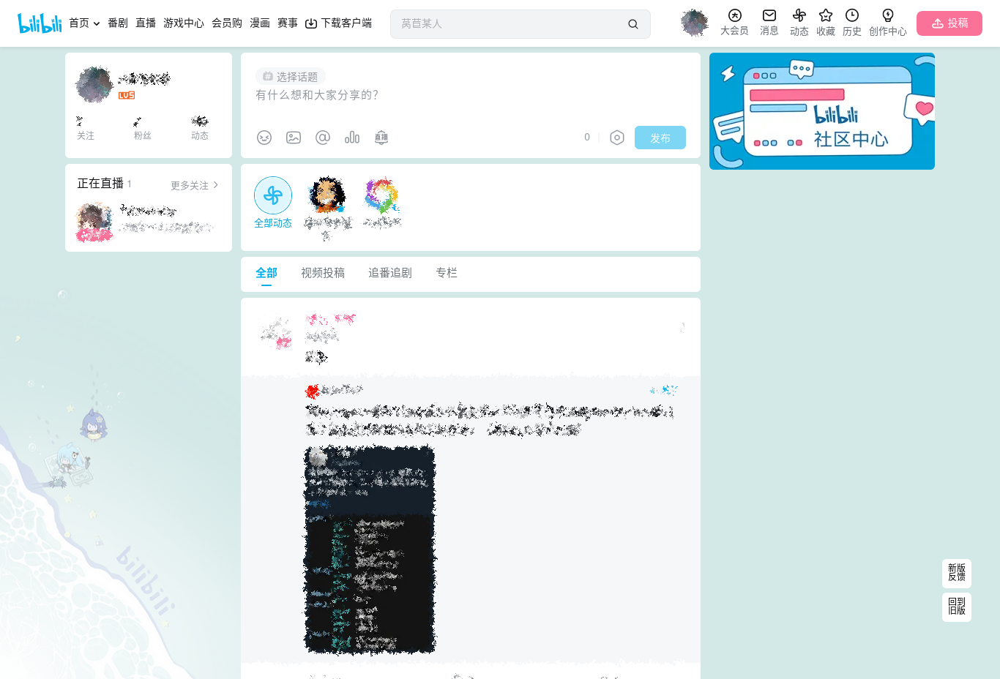

# 闭嘴吧逼逼话题鸡

隐藏哔哩哔哩弹幕网（www.bilibili.com）个人动态页的话题板块。**眼不见心不烦啊。**

同时适用于B站的旧版动态和新版动态。

## 截图

### 旧版动态

-   Before
    

-   After
    

### 新版动态

-   Before
    

-   After
    

## 使用说明

### 安装

用户需先安装用户脚本管理器，推荐使用 **油猴 (Tampermonkey)**：

-   [Chrome 应用商店 扩展程序](https://chrome.google.com/webstore/detail/tampermonkey/dhdgffkkebhmkfjojejmpbldmpobfkfo?hl=zh-CN)
-   [火狐附加组件](https://addons.mozilla.org/zh-CN/firefox/addon/tampermonkey/)
-   [Microsoft Edge 外接程序](https://microsoftedge.microsoft.com/addons/detail/tampermonkey/iikmkjmpaadaobahmlepeloendndfphd?hl=zh-CN&gl=CN)

或其他同类扩展程序。用户脚本管理器的安装等相关资料均可参见 [Greasy Fork](https://greasyfork.org/)。

之后安装本用户脚本。脚本安装地址：<https://greasyfork.org/zh-CN/scripts/461242>，点击页面上的 _安装此脚本_ 即可。

## 源码

Github：<https://github.com/catscarlet/shut-the-bibi-up>

## License

This project is licensed under **GNU AFFERO GENERAL PUBLIC LICENSE Version 3**
